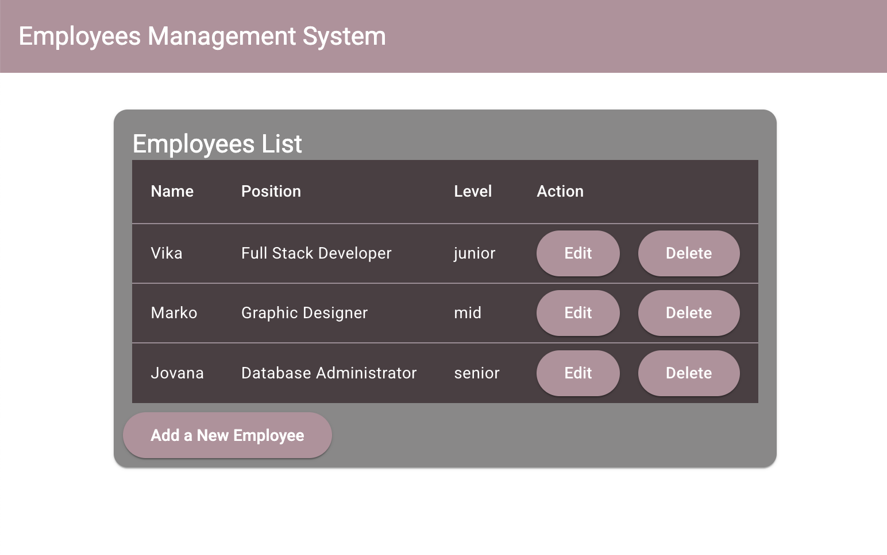

# Employees Management System

Made with MongoDB, Express, NodeJS, Angular

RESTful API app that can Create, Read, Update and Delete employees
(CRUD operations)

User Authentication and Authorization:

- registration and login form, hashed pass saved to mongoDB
- express routes for authentication, issuing a JSON Web Token (JWT) upon successful authentication
- on login token is stored and sent in requests

Create

Read

Update

Delete

